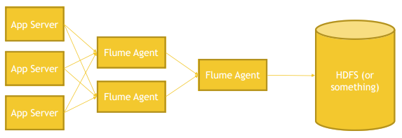

# Apache Flume

Streaming data into cluster
Developed with Hadoop in mind

- Build-in sinks fir HDFS and Hbase
- Originally made to handle log aggregation

***Flume is buffering data before delivering to the cluster.***

## Anatomy of a Flume Agent and Flow

### Three components of a Flume Agent:

- Source
  - Where data is comming from
  - Optionally Channel Selectors and Interceptors
    - Selectors:
      - based on some selection the data is sent somewhere
    - Interceptors:
      - Data can add or reschape the data
- Channel
  - how the data is transferred between Source and Sink (via memory or files)
- Sink
  - Where the data is going
  - multiple Sinks and can be organized into Sink Groups
  - A Sink can connect to only ***one*** Channel
    - Channel is notified te delete a message once the Sink processes it

### Build-in Source Types:

- Spooling directory, Avro (specific Hadoop format), Kafka, Exec (command-line), Thrift, Netcat (tcp/ip), HTTP, Custom, etc

### Build-in Sink Types:

- HDFS, Hive, HBase, Avro, Thrift, Elasticsearch, Kafka,Custom

Flume Example

First layer close to source and proces data. ie are in a local datacenter.
The second layer collects from and incests into the sink.
Between first amnd second layer of agents are source AVRO and Sink AVRO to transfer data very efficient.
