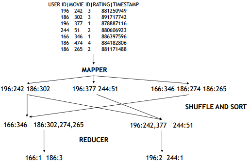
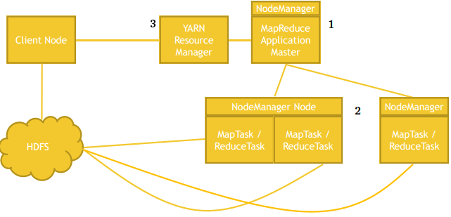

# Mapreduce

## Conceptional

1. Raw Data
2. Mapper
3. Shuffle and Sort (happens automatically by Hadoop)
4. Reducer

## Distribution

Raw data is splitup in partitions and partitions are distributed to different nodes

## How all works together

Important is data locality. Client node stores data into HDFS. The DataNodes need to access this data, therefor the data has toe be distibuted efficient.

## Handling Failure

1. Application master monitors worker tasks for errors or hanging

- restarts as needed
- Preferably on a diffent node

1. application master goes down

- YARN can try to restart it

2. Entire node goes down

- could be application master (1)
- resource manager will try to restart (Hadoop 3 has solution)

1. Resource manager goes down

- only when Zookeeper has a standby and will start an replace

