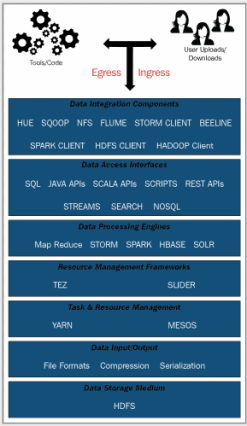

Into

**HDFS**: Hadoop Distributed File System

### Hadoop 2
- high availability
- federations
- snapshots

**YARN** was introduced in Hadoop version 2 to overcome scalability issues and resource management jobs.

### Hadoop 3
- Overhead due to data replication factor
    - Default replication factor of 3
    - fault-tolerant with better data locality and better load balancing of jobs among DataNodes
    - overhead cost of around 200%
    - less/not used data consumes resources
    - Solution: **erasure coding**. This stores data durably while saving space significantly.
- YARN Timeline service re-architected
- YARN opportunistic containers & distributed scheduling,
- Optimizing map output collector: use of Java Native Interface (JNI) for optimazation. Useful for shuffle-intensive operations.
- higher availability factor of NameNode. While it is a highly available solution, in the case of the failure of an active (or standby) NameNode, it will go back to a non-HA mode. Support for ++more than one++ standby NameNode has been introduced.
Dependency on Linux ephemeral port range: default ports are moved out of the ephemeral port range
- Disk-level data skew: multiple disks (or drives) managed by DataNodes. Sometimes, adding or replacing disks leads to significant data skew within a DataNode. 
### Origins
- Fault tolerant: The system should be able to handle any failure of the machines automatically, in an isolated manner. This means the failure of one machine should not affect the entire application.
- Load balancing: If one machine fails, then its work should be distributed automatically to the working machines in a fair manner.
- Data loss: once data is written to disk, it should never be lost even if one or two machines fail.

**Concept of blocks and replication**:
Blocks are created by splitting each file into 64 MB chunks (the size is configurable) and replicating each block three times by default so that, if a machine holding one block fails, then data can be served from another machine.

**MapReduce model**
- Provide parallelism
- Fault tolerance
- Data locality features.
(Data locality means a program is executed where data is stored instead of bringing the data to the program.)

**NameNodes** and **DataNodes** have a specific role in managing overall clusters.
NameNodes are responsible for maintaining metadata information.

### Hadoop Logical View

### Ingress/egress/processing
- Ingesting (ingress) data
- Reading (Egress) data
- Processing already ingested data
These actions can be automated via the use of tools or automated code.

### Data integration components
For ingress/egress or data processing in Hadoop, you need data integration components. These components are tools, software, or custom code that help integrate the underlying Hadoop data with user views or actions. These components give end users a unified view of data in Hadoop across different distributed Hadoop folders, in different files and data formats.
ie Hue, Sqoop, Java Hadoop Clients, Hive, Beeline Clients

### Data access interfaces
Data access interfaces allow you to access underlying Hadoop data using different languages such as SQL, NoSQL, or APIs such as Rest and JAVA APIs, or using different data formats such as search data formats and streams. Sometimes, the interface that you use to access data from Hadoop is tightly coupled with underlying data processing engines. ie Spark SQL, SOLR or elastic search.

### Data Processing Engines
To manipulate underlying data and have different mechanisms to use system resources and have completely different SLA guarantees.ie MapReduce processing engine is more disk I/O-bound (keeping RAM memory usage under control) and it is suitable for batch-oriented data processing. Similarly, SPARK in a memory processing engine is less disk I/O-bound and more dependent on RAM memory. It is more suitable for stream or micro-batch processing.

### Resource management frameworks
Expose abstract APIs to interact with underlying resource managers for task and job scheduling in Hadoop. These frameworks ensure there is a set of steps to follow for submitting jobs in Hadoop using designated resource managers such as YARN or MESOS. These frameworks help establish optimal performance by utilizing underlying resources systematically. ie Tez or Slider.

### Task and resource management
sharing a large cluster of machines across different, simultaneously running applications in a cluster. YARN and MESOS.
YARN is a Unix process while MESOS is Linux-container-based

### Data input/output
The data input/output layer is primarily responsible for different file formats, compression techniques, and data serialization for Hadoop storage.

### Data Storage Medium
HDFS is the primary data storage medium used in Hadoop. It is a Java-based, high-performant distributed filesystem that is based on the underlying UNIX File System.
