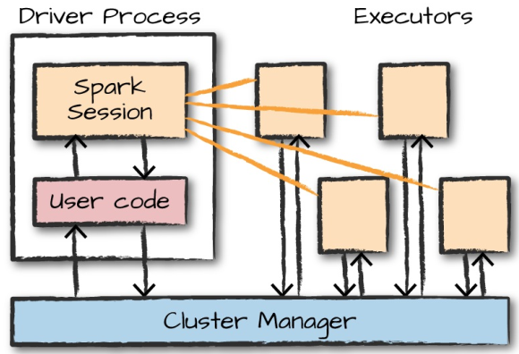
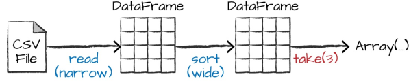
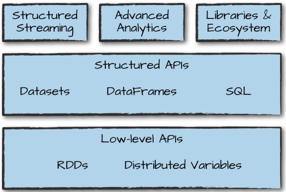
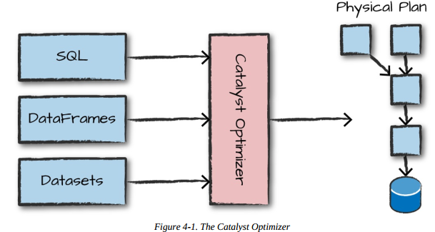
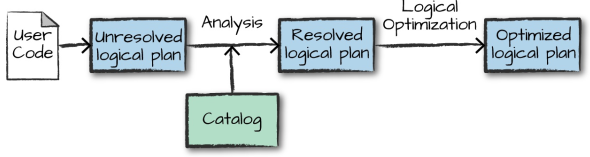
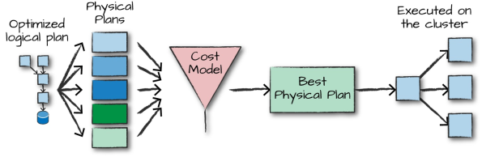

# Apache Spark Architecture

Spark applications consists of

- driver process
  - maintaining information about the Spark Application;
  - responding to a user’s program or input;
  - analyzing, distributing, and scheduling work across  the executors;
- executor processes
  - executing code assigned to it by the driver;
    - reporting the state of the computation on that executor back to the driver node;



## cluster manager

controls physical machines and allocates
resources to Spark Applications:

- Spark’s standalone cluster manager
- YARN
- Mesos

Spark in _local mode_: driver and executor are simply processes.

### Language APIs

All languages (R, Python, Scala, Java) have similar performance characteristics when using structured API's.
When Python is using UDF then performance drops. Reason the Python code is executed in a separate Python process outside the JVM.

Spark has two fundamental sets of APIs:

- low-level "unstructured" (RDD)
- higher-level "structured" (Dataframe and Dataset)

### Spark Session

```scala
val myRange = spark.range(1000).toDF("number")
```

range of numbers represents a distributed collection: each part of this range of numbers exists on a different executor

### Partitions

To allow every executor to perform work in parallel, Spark breaks up the data into chunks called partitions. A  partition is a collection of rows that sit on one physical machine in your cluster

```scala
spark.conf.set("spark.sql.shuffle.partitions", "5")
```

Default is 200 partitions

### Transformations

 Core data structures are immutable. To “change” , ie a DataFrame, you need to instruct Spark how you would like to modify it to do what you want. These instructions are called *transformations*. Return no output (**lazy evaluation**) This is because we specified only an abstract transformation, and Spark will not act on transformations until we call an action, but build up a plan of transformations (predicate pushdown)

Types of transformations:

- narrow: one input partition ==> one output partition
- wide: input partitions ==> many output partitions (shuffle= Spark writes to disk) ie aggregation and sort

### Actions

An action instructs Spark to compute a result from a series of transformations. ie count.

Kind of actions:

- view data in the console
- collect data to native objects in the respective language
- write to output data sources



### logical plan

The logical plan of transformations that we build up defines a lineage for the DataFrame so that at any given point in time, Spark knows how to recompute any partition by performing all of the operations it had before on the same input data

### DataFrames and SQL

Register any DataFrame as a table or
view (a temporary table) and query it using pure SQL. There is **no performance** difference between writing SQL queries or writing DataFrame code, they both “compile” to the same
underlying plan that we specify in DataFrame code

```scala
flightData2015.createOrReplaceTempView("flight_data_2015")

val sqlWay = spark
    .sql("""SELECT DEST_COUNTRY_NAME, count(1) FROM flight_data_2015 GROUP BY DEST_COUNTRY_NAME
""")

val dataFrameWay = flightData2015
    .groupBy('DEST_COUNTRY_NAME)
    .count()
```

---

## Spark Toolset



### Running Production Applications (spark-submit)

spark-submit does one thing: it lets you send your application code to a cluster and launch it to execute there

On local machine:

```bash
## specify location of external jars
LIB=......
JARS=$(files=("$LIB"/*.jar); IFS=,; echo "${files[*]}")

./bin/spark-submit \
--class org.apache.spark.examples.SparkPi \
--master local \
--jars $JARS \
./examples/jars/spark-examples_2.11-2.2.0.jar 10
```

### Datasets: Type-Safe Structured APIs

Datasets: statically type code in Java and Scala

Dataframes: distibuted collection of objects of type Row
Datasets: collection of typed objects ie Scala Seq

Reason to use Datasets: especially attractive for writing large applications, with which multiple software engineers must interact through well-defined interfaces.

```scala
case class Flight(DEST_COUNTRY_NAME: String,
ORIGIN_COUNTRY_NAME: String, count: BigInt)

val flightsDF = spark.read.parquet("/data/
2010-summary.parquet/")

val flights = flightsDF.as[Flight]
```

Advantage of Dataset use is that when call collect or take on a Dataset, it will collect objects of the proper type in your Dataset, not DataFrame Rows. This makes it easy to get type safety and securely perform manipulation in a distributed and a local manner without code changes

### Structured Streaming

Structured Streaming is a high-level API for stream processing that became production-ready in Spark 2.2.
It also makes it easy to conceptualize because you can write your batch job as a way to prototype it and then you can convert it to a streaming job

### Machine Learning and Advanced Analytics

Machine learning algorithms in MLlib require that data is represented as numerical values. All machine learning algorithms in Spark take as input a Vector type

### Lower-Level APIs

Virtually everything in Spark is built on
top of RDDs. One thing that you might use RDDs for is to parallelize raw data that you have stored in memory on the driver machine.
RDDs are available in Scala as well as Python. However, they’re not equivalent.

### Spark’s Ecosystem and Packages

[Spark Packages](https://spark-packages.org/)

---

## Structured APIs

The Structured APIs are the fundamental abstraction that you will use to write the majority of your data flows.
DataFrames and Datasets represent immutable, lazily evaluated plans that specify what operations to apply to data residing at a location to generate some output.
Support schema on write and schema on read.

Spark uses an engine called **Catalys** and Spark is a program language in it own. The majority of our manipulations will operate strictly on Spark types.

Within the Structured APIs, two more APIs:

- untyped Dataframes; typed at runtime
- typed Datasets at compile time

The “Row” type is Spark’s internal representation of its optimized in-memory format for computation. DataFrames are simply Datasets of Type Row.

### Columns

Columns represent a simple type like an integer or string a complex type like an array or map, or a null value.

### Spark Types

To work with the correct Scala types, use the following:

```scala
import org.apache.spark.sql.types._
val b = ByteType
```

Te get the Spark type:
the Scala type ie:

- Short ==> ByteType
- Int ==> IntegerType
- etc

### Overview of Structured API Execution

single structured API query steps:

1. Write DataFrame/Dataset/SQL Code
2. If valid code, Spark converts this to a Logical Plan.
3. Spark transforms this Logical Plan to a Physical Plan, checking for optimizations along the way
4. Spark then executes this Physical Plan (RDD manipulations) on the cluster.

overview


Logical plan is first created and represents a set of abstract transformations that do not refer to executors or drivers. This plan is unresolved because although your code might be valid, the tables or columns that it refers to might or might not exist. Spark uses the catalog, a repository of all table and DataFrame information, to resolve columns and tables in the analyzer. The analyzer might reject the unresolved logical plan if the required table or column name does not exist in the catalog. Packages can extend the Catalyst to include their own rules for domain-specific optimizations.



The physical plan, often called a Spark plan, specifies how the logical plan will execute on the cluster by generating different physical execution strategies and comparing them through a cost model. Physical planning results in a series of RDDs and transformations



### Execution

Upon selecting a physical plan, Spark runs all of this code over RDDs. further optimizations at runtime, generating native Java bytecode that can remove entire tasks or stages during execution.

---

## Basic Structured Operations

### Schemas

A schema is a StructType made up of:

- a number of fields
- StructFields, that have a name
- type (Spark types)
- Boolean flag: column can contain missing or null values
- optionally specify associated metadata with that column

The metadata is a way of storing information about this column (Spark uses this in its machine learning library).

```scala
import org.apache.spark.sql.types.{StructField,StructType, StringType,LongType}
import org.apache.spark.sql.types.Metadata

val myManualSchema = StructType(Array(
StructField("DEST_COUNTRY_NAME", StringType, true),
StructField("ORIGIN_COUNTRY_NAME", StringType, true),
StructField("count", LongType, false,
Metadata.fromJson("{\"hello\":\"world\"}"))
))

val df = spark
    .read
    .format("json")
    .schema(myManualSchema)
    .load("/data/2015-summary.json")
```

### Columns and Expressions

You cannot manipulate an individual column outside the context of a DataFrame; you must use Spark transformations
within a DataFrame to modify the contents of a column.

Different ways to construct and refer to columns:

```scala
import org.apache.spark.sql.functions.{col, column}
col("someColumnName")
column("someColumnName")
$"someColumnName"
'someColumnName

df.col("count")   // use
```

**Columns are not resolved until we compare the column names with those we are maintaining in the catalog. Column and table resolution happens in the analyzer
phase.**

### Expressions

Columns are expressions. An expression is a set of transformations on one or more values in a record in a DataFrame. (a function that takes as input one or more column names, resolves them, and then potentially
applies more expressions to create a single value for each record in the dataset)

 Each row in a DataFrame is a single record as an object of type Row

### Creating Rows

Only DataFrames have schemas. Rows themselves do not have
schemas.

```scala
import org.apache.spark.sql.Row
val myRow = Row("Hello", null, 1, false)

myRow(0) // type Any
myRow(0).asInstanceOf[String] // String
myRow.getString(0) // String
myRow.getInt(2) // Int
```

### Creating DataFrames

```scala
val df = spark
    .read
    .format("json")
    .load("/data/2015-summary.json")
df.createOrReplaceTempView("dfTable")
```

or

```scala
import org.apache.spark.sql.Row
import org.apache.spark.sql.types.{StructField,StructType,StringType,LongType}

val myManualSchema = new StructType(Array(
new StructField("some", StringType, true),
new StructField("col", StringType, true),
new StructField("names", LongType, false)))
val myRows = Seq(Row("Hello", null, 1L))

val myRDD = spark
    .sparkContext
    .parallelize(myRows)

val myDf = spark
    .createDataFrame(myRDD, myManualSchema)

myDf.show()
```

### select and selectExpr

```scala
mDF.select("colA","colB").show()
mDF.select('colA).show()
mDF.select(col("colA")).show()
mDF.select(expr("colA as aap")).show() // most flexible
mDF.select(expr("colA").alias("aap")).show()
mDF.selectExpr("colA as aap", "colB").show() // daily use; opens up the true power of Spark.
```

### Adding, renaming and dropping Columns

Dataframe is NOT modified!!

```scala
df.withColumn("numberOne", lit(1))
df.withColumn("withinCountry", expr("ORIGIN_COUNTRY_NAME == DEST_COUNTRY_NAME"))

df.withColumnRenamed("DEST_COUNTRY_NAME","dest")

df.drop("DEST_COUNTRY_NAME")

```

### Case Sensitivity

By default Spark is case insensitive. Make sensitive:

```scala
spark.sql("""set spark.sql.caseSensitive true""")
```

### Changing a Column’s Type (cast)

```scala
df.withColumn("count2", col("count").cast("long"))
```

### Filtering Rows and Unique Rows

```scala
df.filter(col("count") < 2).show(2)
df.where("count < 2").show(2)

df.select("ORIGIN_COUNTRY_NAME", "DEST_COUNTRY_NAME")
    .distinct().count()
```

### Random Samples and Split

```scala
// Random Sample
val seed = 5
val withReplacement = false
val fraction = 0.5
df.sample(withReplacement, fraction, seed).count()

// Random Splits
val dataFrames = df
    .randomSplit(Array(0.25, 0.75), seed)
dataFrames(0)
    .count() > dataFrames(1)
    .count() // False
```

---

## Working with Different Types of Data

**lit function**. This function converts a type in another language to its correspnding Spark representation.

```scala
import org.apache.spark.sql.functions.lit
df.select(lit(5), lit("five"), lit(5.0))
```

```scala
// where as in sql; === equal =!= not equal
vlucht.where(col("count") === 15)
    .select("*")
    .show(10)

// best way
vlucht.where("count = 15").show(10)

// column aap boolean; == equal
vlucht.selectExpr("*","count == 15 as aap").show(10)
```

**Better just write SQL!!!!**

```scala
// compute summary statistics
df.describe().show()
```

### Working with Dates and Timestamps

There are dates, which focus exclusively on calendar dates, and timestamps, which include both date and time information. Spark’s TimestampType class supports only second-level precision, which means that if you’re going to be working with milliseconds or microseconds, you’ll need to work around this problem by potentially operating on them as longs.

### Working with Complex Types

Structs:
Think of structs as DataFrames within DataFrames

```scala
import org.apache.spark.sql.functions.struct
val complexDF = df.select(struct("Description","InvoiceNo")
    .alias("complex"))

complexDF.select(col("complex")
    .getField("Description"))
    .show()
```

split
  
```scala
import org.apache.spark.sql.functions.split
df.select(split(col("Description"), " ")
    .alias("array_col"))
    .selectExpr("array_col[0]")
    .show(2)
```

### User-Defined Functions (UDF)

One of the most powerful things that you can do in Spark is define your own functions. Functions that operate on the data, record by record.

Performance considerations:

- UDFs in Scala or Java, you can use it within the Java Virtual Machine (JVM)
- In Python Spark starts a Python process on the workers and serializes all data to a format that Python understands.

```scala
val udfExampleDF = spark.range(5).toDF("num")
def power3(number:Double):Double = number * number * number

import org.apache.spark.sql.functions.udf
val power3udf = udf(power3(_:Double):Double)

udfExampleDF.select(power3udf(col("num"))).show()

// register

spark.udf.register("power3", power3(_:Double):Double)
udfExampleDF.selectExpr("power3(num)").show(2)
```

## Aggregations

groupings types in Spark:
(all return a RelationalGroupedDataset)

- group by
- window
- grouping set
- rollup
- cube
