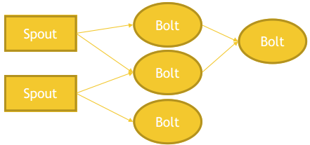
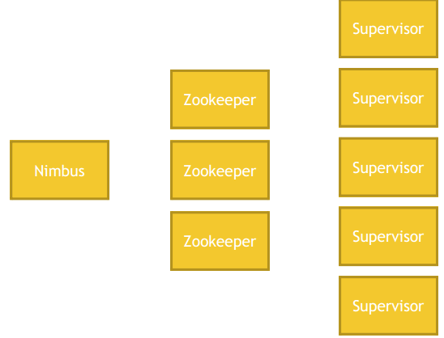

# Apache Storm

- Real-time continuous streaming data on clusters
- Runs on top of Yarn
- Works on individual events (**NOT** micro-batches like Spark)
  - Storm is a better solution to Spark streaming
- Storm is perfect for sub-second latency (fast)

## Storm Topology

- Streams consists of ___tuples___ that flow through
- Spouts are ___sources___  of stream data (from Kafka, Twitter, etc)
- ___Bolts___ process stream data as it's recieved
  - transform, aggregate, write to database / HDFS
  - So no final state. Data stream continous goes on an on forever
- Storm topology is a graph of spouts ans bolts tat process the stream
  - can get complex (In Spark you get the DAG for free)

## Storm Architecture

- Nimbus is a single point of failure
  - Job tracker
  - can restart quickly witout loosing any data
  - HA is available as a Nimbus backup server
- Zookeeper (in it self is HA)
- Supervisors are doing the work

## Developing Storm applications

- usually in Java
  - Bolts may be directed through scripts in other languages
  - Selling point of Storm, but in practice in Java
- Storm Core
  - lower-level API for Storm
  - "At-least-once" semantics (possibility of duplicated data)
- Trident
  - Highlevel API for Storm   <=== prefer
  - "Exactly once" semantics
  - After submitted, Storm runs forever - until explicitly stopped
  
## Storm vs Spark Streaming

Storm 
- tumbling window
  -  ie all events in the past 5 sec exactly; no overlap of events
- sliding window
  - can overlap by design
  Storm only Java

Spark
  - graph, ML, micro-batch streaming
  Spark in Scala and Python
  
Kafka and Storm => perfect combination
