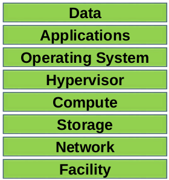
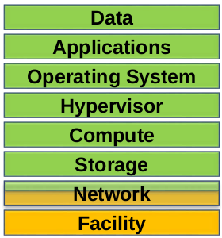
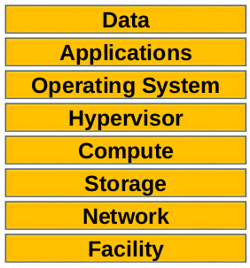
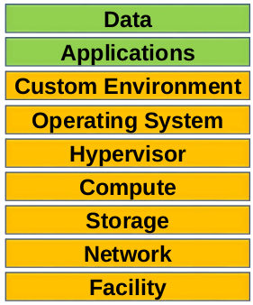
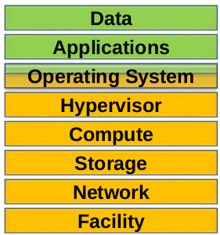

# Traditional IT Services Deployment Models

1. On Premises solutions (CPE – Customer Premises Equipment)
- All equipment is located in your building
- All equipment is owned by you
- There are clear lines of demarcation – everything in the building is your
- responsibility, the connections between offices are your network service
- provider’s responsibility
- Equipment is CapEx
- New equipment will typically take over a week to deploy
- Equipment requires technology refreshes
- You need to consider redundancy

 

2. Colocation or ‘Colo’ services
- A colocation centre or “colo", is a data center location where the owner of the facility rents out space to external customers
- You own your own server, storage, and networking equipment within the colo facility (CapEx cost)
- The facility owner provides power, cooling, and physical security for their customer’s server, storage, and networking equipment

# Server Virtualisation

 

1. Type 1 Hypervisors run directly on the system hardware (Bare Metal)
   ie VMware ESXi, Microsoft Hyper-V, Red Hat KVM
2. Type 2 Hypervisors run on top of a host operating system
   ie VMware Workstation, Player and Fusion, Virtualbox, Parallels, QEMU

# Definition Cloud Computing NIST [1]:
> Cloud computing is a model for enabling ubiquitous, convenient, on-
demand network access to a shared pool of configurable computing
resources (e.g., networks, servers, storage, applications, and services) that can be rapidly provisioned and released with minimal
management effort or service provider interaction

# Essential Characteristics
1. **On-demand self-service.** A consumer can unilaterally provision computing capabilities, such as server time and network storage, as needed automatically without requiring human interaction with each service provider.

3. **Broad network access.** Capabilities are available over the network and accessed through standard mechanisms that promote use by heterogeneous thin or thick client platforms (e.g., mobile phones, tablets, laptops, and workstations).
>Comments: Servers can be quickly provisioned and decommissioned based on current demand. Elasticity allows customers to achieve cost savings and is often a core justification for adoption
 
4. **Resource pooling.** The provider’s computing resources are pooled to serve multiple consumers using a multi-tenant model, with different physical and virtual resources dynamically assigned and reassigned according to consumer demand. There is a sense of location independence in that the customer generally has no control or knowledge over the exact location of the provided resources but may be able to specify location at a higher level of abstraction (e.g., country, state, or datacenter). Examples of resources include storage, processing, memory, and network bandwidth.

5. **Rapid elasticity.** Capabilities can be elastically provisioned and released, in some cases automatically, to scale rapidly outward and inward commensurate with demand. To the consumer, the capabilities available for provisioning often appear to be unlimited and can be appropriated in any quantity at any time.
   
6. **Measured service.** Cloud systems automatically control and optimize resource use by leveraging a metering capability1 at some level of abstraction appropriate to the type of service (e.g., storage, processing, bandwidth, and active user accounts). Resource usage can be monitored, controlled, and reported, providing transparency for both the provider and consumer of the utilized service.

# Service Models:
## On Premise (green customer managed, orange Provider managed)

## Colo (green customer managed, orange Provider managed)

1. ## Software as a Service (SaaS)
   The capability provided to the consumer is to use the provider’s applications running on a cloud infrastructure. The applications are accessible from various client devices through either a thin client interface, such as a web browser (e.g., web-based email), or a program interface. The consumer does not manage or control the underlying cloud infrastructure including network, servers, operating systems, storage, or even individual application capabilities, with the possible exception of limited user-specific application configuration settings.
   

   > examples:
   - Microsoft Office 365
   - Salesforce.com
   - Intuit
   - Adobe Creative Cloud
   - Gmail

2. ## Platform as a Service (PaaS)

   The capability provided to the consumer is to deploy onto the cloud infrastructure consumer-created or acquired applications created using programming languages, libraries, services, and tools supported by the provider. 3 The consumer does not manage or control the underlying cloud infrastructure including network, servers, operating systems, or storage, but has control over the deployed applications and possibly configuration settings for the application-hosting environment. 
   > examples:
   - AWS Elastic Beanstalk
   - Microsoft Azure (offers both IaaS and PaaS services)
   - Google Apps
   - Salesforce Force.com
   - IBM Bluemix

3. ## Infrastructure as a Service (IaaS)

The capability provided to the consumer is to  rovision processing, storage, networks, and other fundamental computing resources where the consumer is able to deploy and run arbitrary software, which can include operating systems and applications. The consumer does not manage or control the underlying cloud infrastructure but has control over operating systems, storage, and deployed applications; and possibly limited control of select networking components (e.g., host firewalls).

>Cloud Providers will often offer three distinct flavours of IaaS compute:

- Virtual machines on shared physical servers
  - different customers share same underlying physical servers
  - least expensive
  - least number of options vCPU, RAM and storage
  - provision quickly
  - most common deployed option
- Virtual machines on dedicated physical servers
  - customer is guaranteed that the underlying physical server is dedicated to them
  - more options vCPU, RAM and storage
  - may be require to sign a minimum length contract
- Dedicated bare-metal physical servers
  - customer is given access to their own physical servers
  - hypervisor is NOT installed and managed by cloud provider
  - customer can install hypervior by themself or OS directly on HW
  - most expensive option
  - may be require to sign a minimum length contract
  - AWS doesn't offer this option
- Customers can mix and match between the three types

## Optional Servide Model (not defined by NIST) XaaS

> Many cloud providers also offer other ‘as a Services’
These are sometimes described as XaaS ‘Anything as a Service’
Examples include:

- DaaS Desktop As A Service
- DRaaS Disaster Recopry As A Service
- BaaS Backup As A Service
- Storage As A Device
- .... many more ..

# Deployment Models

1. ## Private cloud

   The cloud infrastructure is provisioned for exclusive use by a single organization comprising multiple consumers (e.g., business units). It may be owned, managed, and operated by the organization, a third party, or some combination of them, and it may exist on or off premises.
    - different than On Prem?
      - On-Demant Self-Service
      - Rapid Elastic
      - Broad Network Acces
      - Resource Pooling
      - Measured Service
      - orders a new server typically through a web portal
      - company will use automation software
      - Private Cloud is most suitable for large companies where the long term ROI and efficiency gains can outweigh the initial effort and cost to set up the infrastructure and automated workflows

2. ## Community cloud

    The cloud infrastructure is provisioned for exclusive use by a specific community of consumers from organizations that have shared concerns (e.g., mission, security requirements, policy, and compliance considerations). It may be owned, managed, and operated by one or more of the organizations in the community, a third party, or some combination of them, and it may exist on or off premises.
    - least common deployment model
    - similar to a traditional extranet, but with full shared data center services instead of just network connectivity between On Prem offices

3. ## Public cloud

    The cloud infrastructure is provisioned for open use by the general public. It may be owned, managed, and operated by a business, academic, or government organization, or some combination of them. It exists on the premises of the cloud provider.
   - examples
     - AWS
     - Microsoft Azure
     - IBM Bluemix
     - Salesforce
   - Most common deployment model

4. ## Hybrid cloud

    The cloud infrastructure is a composition of two or more distinct cloud infrastructures (private, community, or public) that remain unique entities, but are bound together by standardized or proprietary technology that enables data and application portability (e.g., cloud bursting for load balancing between clouds).
    - Companies with limited Private Cloud infrastructure may ‘cloud burst’ into Public Cloud for additional capacity when required
    - A company could also have Private Cloud at their main site and use Public Cloud for their Disaster Recovery location

sources:
1. [The NIST Definition of Cloud Computing](https://csrc.nist.gov/publications/detail/sp/800-145/final

2. [A Practical Introduction to Cloud Computing](https://www.udemy.com/introduction-cloud-computing)