# **Data Streaming**

Data streaming is optimal for time series and detecting patterns over time.
Things like traffic sensors, health sensors, transaction logs, and activity logs are all good candidates for data streaming.

## Data Streaming Challenges
- Plan for scalability.
- Plan for data durability.
- Incorporate fault tolerance in both the storage and processing layers.
  
## Data Streaming Tools (popular)
- [Amazon Kinesis Data Firehose](https://aws.amazon.com/kinesis/data-firehose/) Managed, scalable, cloud-based service
- [Apache Kafka](https://kafka.apache.org/) Distributed publish-subscribe messaging system,integrates applications and data streams
- [Apache Flink](https://flink.apache.org/) Distributed computation over data streams
- [Apache Storm](https://storm.apache.org/) High data velocity.

Test regel

# **Devoxx Apache Kafka Presentation of James Ward**

Integration Complexity:
- No System of recods; unknown where the data came initially
- Sychronisation is hard
- Scaling ETL is hard; horizonally is best, but fails often
- processing is error-prone; parsing, missing data ...

### integration architecture
Events not tables
Streams as ledger (records all events and can go back in time)
First-class partitioning (scala horizontally)

### Why not messaging system?
- is ordening garanteed?
- Horizontal scaling
- push? Back pressure? Difference in speed ie one source is faster then an other.
The Reactive Streams specification defines a model for **back pressure**. The elements in the Streams are produced by the producer at one end, and the elements are consumed by the consumer at the other end. The most favorable condition is where the rate at which the elements are produced and consumed is the same. But, in certain situations, the elements are emitted at a higher rate than they are consumed by the consumer. This scenario leads to the growing backlog of unconsumed elements. The more the backlog grows, the faster the application fails. Is it possible to stop the failure? And if yes, how to stop this failure? We can certainly stop the application from failing. One of the ways to do this is to communicate with the source ... etc

### **Kafka = Event Ledge + Distributed & Redundant**
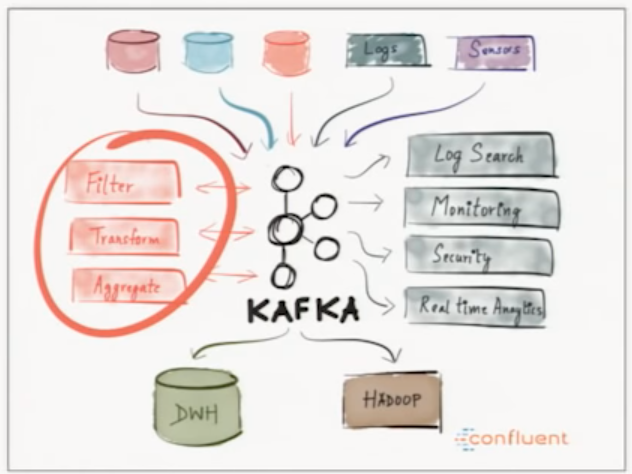

### **Kafka: Liniar scaling** (near network speed)

Kafka Fundamentals:
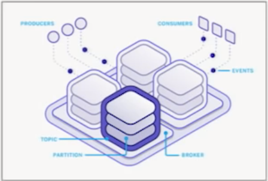
- messaging system Semantics
- Clustering is core (scaling horizontal)
- Durabiliy & Ordering Guarantees (no events are lost and in right order)

Use cases:
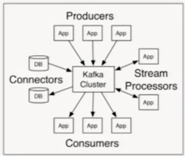
- modern ETL/CDC 
     (*change data capture (CDC) is a set of software design patterns used to determine (and track) the data that has changed so that action can be taken using the changed data. Also, Change data capture (CDC) is an approach to data integration that is based on the identification, capture and delivery of the changes made to enterprise data sources.*)
- Data Pipelines
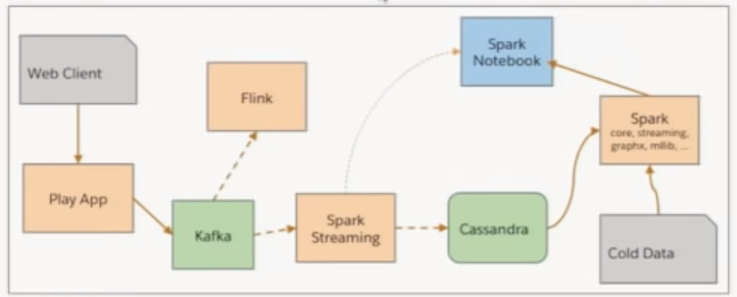
- Big Data Ingest

**Records/events**
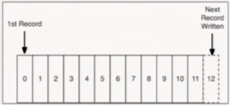
- Record: key, value, timestamp
- Immutable
- Append only to the ledger
- Persisted to disk (all on disk)
    AKA: a log

## Producers & Consumers
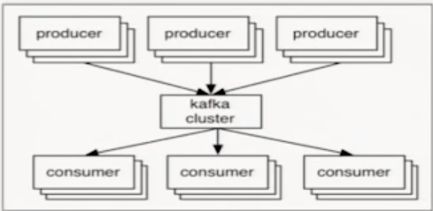
* Broker = Node in the cluster
* Producer writes records to a brober
* Consumer reads records from a broker (is asking for records)
* Leader/follower for cluster distribution

## Topcs & Partitions
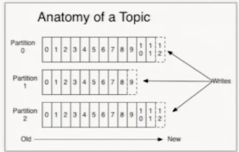
* Topic = Logical name with 1..n partitions
* Partitions are replicated
* Ordering is guaranteed for a partition

# Offset
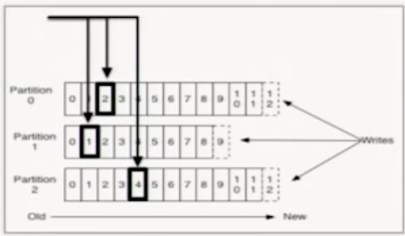
Offset the way Kafka keeps track of the ordering
* Unique sequential ID (per partition)
* Consumers track offsets (give me my offset)
* Benetis: replay, different speed consumers, etc

# producer offset
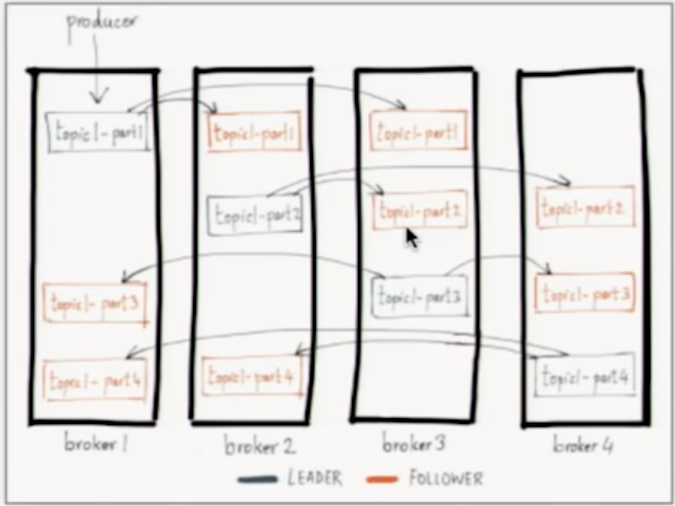
Send message to given partion
* Wrirtes are to the leader of a partition (allways)
* Partitioning can be done mannually or based on a key
* Replication Factor is Topic-based
* Auto-rebalancing is arranged by Kafka
* followers (hot standby) are there when leader nodes go down. A new leader will be selected from the followers
* whole cluster is using Zookeeper to keep track of all nodes

# Consumer groups
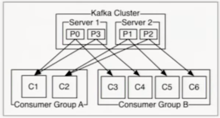
* Logical name for 1 or more consumers
* message consumption is load balanced across all consumers in a group

# Delivery Guarantees
* **Producers:**
    * Async (No guarantee Kafka has recorded; best performance)
    * Committed to Leader 
        * depends saturation (verzadeging) node
        * depends diskspeed
    * Comitted to Leader and Quorum (part of folowers) 
        * very sure not loosing data
        * Depends latency between nodes; so network latency

* **Consumer:**
    * at-least-once (default)
        * Kafka delivers a block of records requested by the consumer. Begin and end offset are commited. If sending fails only the start was committed and redelivers all messages again.
        * Kafka delivers and waits till consumer commit delivery
    * at-most-once Right in the beginning is commited all messages are recieved. If fails halfway is pitty.
    * effectively-once (at least one delivery)
    * exactly-once (maybe; very difficult/impossible)

# Cool features of Kafka
* log compaction option (removes duplicates) Group-by based on key.
        * trade-off: disk read-writes; background proces
        * gapes in offset-id. Kafka handles this.
* disk not heap
        * kafka uses disk cache
* pagecache to socket: move piece of memory directly though the network; just skip Kafka; usefull for replication
* Balanced partition & leaders (Zookeeper)
* Producer and Consumer Quotes: to avoid fully saturated nodes
* Heraku Kafka

# Clients
* JVM is official
* most other platforms via community
* polling based on consumption side

# AKKA Streams
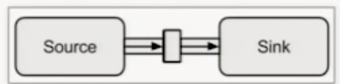
* Implementation of Reactive streams
* Source/Sink Stream programming
* back-pressure etc
* [kafka-adapter](https://github.com/akka/alpakka-kafka)
* [Code examples](https://github.com/jamesward/koober)

Sources:
https://dzone.com/articles/what-is-data-streaming
https://www.youtube.com/watch?v=UEg40Te8pnE    DEVOXX KAFKA
https://en.wikipedia.org/wiki/Change_data_capture

