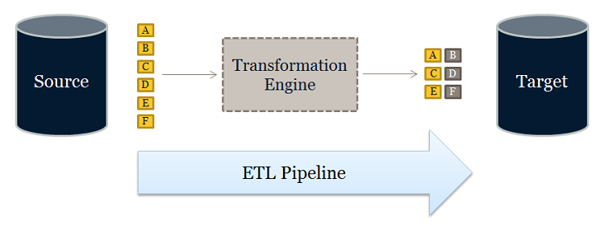
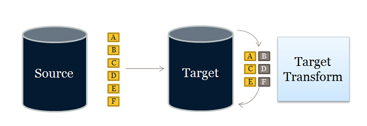

# **ETL**
-   Extraction  (from source to staging area)
-   Transformation (reformatted for datawarehouse purpose)
-   Loaded  (from staging area into datawarehous)

## ETL == Pipeline approach

Many tools available: DataStage, Informatica, or SQL Server Integration Services (SSIS) ==> mostly for transforming
All work in a similair way: read from source, perform changes, write to target
ETL steps can be performed multiple times for a particulair load.
Transformation step can add business logic
Also everything is done in one single step.

An ETL process should have data flowing steadily through it. Risk of running out of memory and/or disk space. (sorting is a classic example - holds entire dataset - if already sorted then rightaway in datawarehouse) Should have the possibility of buffering in pipeline.

Many ETL tools facilitate parallel execution == multiple pipelines.
ETL can be better performing, but needs more training and developement cost.
When ETL is used:
- source and target differ in data types
- volumes of data are small
- transformations are compute-intensive
- data is structured

# **ELT**
- Extract
- Load
- Transform  (so data is transformed **AFTER** loading)
Target system is performing the transformation.

## ELT == NO transformation engine

When ELT is used:
- source and target share same data types (ie DB2 source and target)
- large volumes
- target database is able to handle large data volumes
- data is unstructured

ETL or ELT?? Depends on priorities.

ELT is requires a powerful system in place as target. More such systems available because of analytics.

ie a perfect platform is Hadoop but needs carefully planning

|                 | ETL                                        | ELT                                           |
| --------------- | ------------------------------------------ | --------------------------------------------- |
| **Maturity**    | for 20 years avaliable                     | not as well adapted                           |
|                 | expertise                                  | works not well with structured data           |
| **Flexibility** | Older ETL not suited for unstructured data | can handle structured and unstructured data   |
|                 | Remap data => reload all preveous data!    | In target data more flexible                  |
| **Hardware**    | mostly own engine hardware                 | takes cumpute power from existing hardware    |
|                 | modern ETL tools run in cloud              |                                               |
| **Better for**  | - structured data                          | - Unstructured data                           |
|                 | - Smaller volumes and complex              | - large volumes and less complex computations |
|                 | - On-premise relational databases          | - Cloud environment                           |
|                 |                                            | - Data lake                                   |

## **Merge ETL and ELT approach**
Extract, Transform, Load, Transform

## **Tools**
1. https://www.getdbt.com/
2. https://fivetran.com/
3. https://www.stitchdata.com/

Sources:
https://dzone.com/articles/etl-vs-elt-differences-explained
