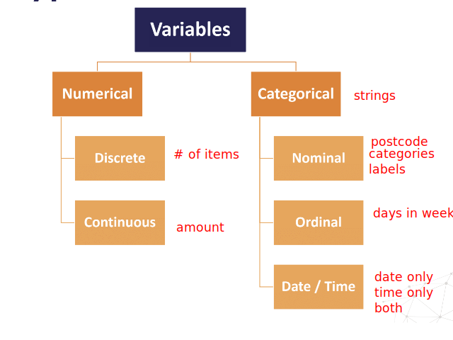

# Data Types

## Nominal Variables

Intrinsic order of the labels:

- Country of birth (Argentina, England, Germany)
- Postcode
- Vehicle make (Citroen, Peugeot, ...)

## Ordinal Variables

Can be meaningfully ordered are called ordinal:

- Student's grade in an exam (A, B, C or Fail)
- Days of the week (Monday = 1 and Sunday = 7)

### Mixed Variables

- Observations show either numbers or categories among their values
  - Number of credit accounts (1-100, U, T, M) U = unknown, T = unverified, M = unmatched)
- Observations show both numbers and categories in their values
  - Cabin (Titanic) (A15, B18, ...)