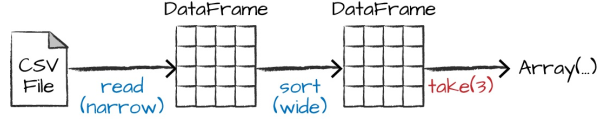

# Apache Spark Architecture

Spark applications consists of

- driver process
  - maintaining information about the Spark Application;
  - responding to a user’s program or input;
  - analyzing, distributing, and scheduling work across  the executors;
- executor processes
  - executing code assigned to it by the driver;
    - reporting the state of the computation on that executor back to the driver node;


## cluster manager

controls physical machines and allocates
resources to Spark Applications:

- Spark’s standalone cluster manager
- YARN
- Mesos

Spark in _local mode_: driver and executor are simply processes.

## Language APIs

All languages (R, Python, Scala, Java) have similar performance characteristics when using structured API's.
When Python is using UDF then performance drops. Reason the Python code is executed in a separate Python process outside the JVM.

Spark has two fundamental sets of APIs:

- low-level "unstructured" (RDD)
- higher-level "structured" (Dataframe and Dataset)

## Spark Session

```scala
val myRange = spark.range(1000).toDF("number")
```

range of numbers represents a distributed collection: each part of this range of numbers exists on a different executor

## Partitions

To allow every executor to perform work in parallel, Spark breaks up the data into chunks called partitions. A  partition is a collection of rows that sit on one physical machine in your cluster

```scala
spark.conf.set("spark.sql.shuffle.partitions", "5")
```

## Transformations

 Core data structures are immutable. To “change” , ie a DataFrame, you need to instruct Spark how you would like to modify it to do what you want. These instructions are called *transformations*. Return no output (**lazy evaluation**) This is because we specified only an abstract transformation, and Spark will not act on transformations until we call an action, but build up a plan of transformations (predicate pushdown)

Types of transformations:

- narrow: one input partition ==> one output partition
- wide: input partitions ==> many output partitions (shuffle= Spark writes to disk) ie aggregation

## Actions

An action instructs Spark to compute a result from a series of transformations. ie count.

Kind of actions:

- view data in the console
- collect data to native objects in the respective language
- write to output data sources

