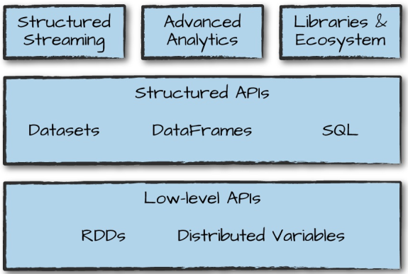

# Apache Spark Architecture

Spark applications consists of

- driver process
  - maintaining information about the Spark Application;
  - responding to a user’s program or input;
  - analyzing, distributing, and scheduling work across  the executors;
- executor processes
  - executing code assigned to it by the driver;
    - reporting the state of the computation on that executor back to the driver node;


## cluster manager

controls physical machines and allocates
resources to Spark Applications:

- Spark’s standalone cluster manager
- YARN
- Mesos

Spark in _local mode_: driver and executor are simply processes.

## Language APIs

All languages (R, Python, Scala, Java) have similar performance characteristics when using structured API's.
When Python is using UDF then performance drops. Reason the Python code is executed in a separate Python process outside the JVM.

Spark has two fundamental sets of APIs:

- low-level "unstructured" (RDD)
- higher-level "structured" (Dataframe and Dataset)

## Spark Session

```scala
val myRange = spark.range(1000).toDF("number")
```

range of numbers represents a distributed collection: each part of this range of numbers exists on a different executor

## Partitions

To allow every executor to perform work in parallel, Spark breaks up the data into chunks called partitions. A  partition is a collection of rows that sit on one physical machine in your cluster

```scala
spark.conf.set("spark.sql.shuffle.partitions", "5")
```

Default is 200 partitions

## Transformations

 Core data structures are immutable. To “change” , ie a DataFrame, you need to instruct Spark how you would like to modify it to do what you want. These instructions are called *transformations*. Return no output (**lazy evaluation**) This is because we specified only an abstract transformation, and Spark will not act on transformations until we call an action, but build up a plan of transformations (predicate pushdown)

Types of transformations:

- narrow: one input partition ==> one output partition
- wide: input partitions ==> many output partitions (shuffle= Spark writes to disk) ie aggregation and sort

## Actions

An action instructs Spark to compute a result from a series of transformations. ie count.

Kind of actions:

- view data in the console
- collect data to native objects in the respective language
- write to output data sources


## logical plan
The logical plan of transformations that we build up defines a lineage for the DataFrame so that at any given point in time, Spark knows how to recompute any partition by performing all of the operations it had before on the same input data

## DataFrames and SQL

Register any DataFrame as a table or
view (a temporary table) and query it using pure SQL. There is **no performance** difference between writing SQL queries or writing DataFrame code, they both “compile” to the same
underlying plan that we specify in DataFrame code

```scala
flightData2015.createOrReplaceTempView("flight_data_2015")

val sqlWay = spark
    .sql("""SELECT DEST_COUNTRY_NAME, count(1) FROM flight_data_2015 GROUP BY DEST_COUNTRY_NAME
""")

val dataFrameWay = flightData2015
    .groupBy('DEST_COUNTRY_NAME)
    .count()
```

# Spark Toolset



## Running Production Applications (spark-submit)

spark-submit does one thing: it lets you send your application code to a cluster and launch it to execute there

On local machine:

```bash
## specify location of external jars
LIB=......
JARS=$(files=("$LIB"/*.jar); IFS=,; echo "${files[*]}")

./bin/spark-submit \
--class org.apache.spark.examples.SparkPi \
--master local \
--jars $JARS \
./examples/jars/spark-examples_2.11-2.2.0.jar 10
```

## Datasets: Type-Safe Structured APIs

Datasets: statically type code in Java and Scala

Dataframes: distibuted collection of objects of type Row
Datasets: collection of typed objects ie Scala Seq

Reason to use Datasets: especially attractive for writing large applications, with which multiple software engineers must interact through well-defined interfaces.

```scala
case class Flight(DEST_COUNTRY_NAME: String,
ORIGIN_COUNTRY_NAME: String, count: BigInt)

val flightsDF = spark.read.parquet("/data/
2010-summary.parquet/")

val flights = flightsDF.as[Flight]
```

Advantage of Dataset use is that when call collect or take on a Dataset, it will collect objects of the proper type in your Dataset, not DataFrame Rows. This makes it easy to get type safety and securely perform manipulation in a distributed and a local manner without code changes

## Structured Streaming

Structured Streaming is a high-level API for stream processing that became production-ready in Spark 2.2. 
It also makes it easy to conceptualize because you can write your batch job as a way to prototype it and then you can convert it to a streaming job

## Machine Learning and Advanced Analytics

Machine learning algorithms in MLlib require that data is represented as numerical values. All machine learning algorithms in Spark take as input a Vector type

## Lower-Level APIs

Virtually everything in Spark is built on
top of RDDs. One thing that you might use RDDs for is to parallelize raw data that you have stored in memory on the driver machine.
RDDs are available in Scala as well as Python. However, they’re not equivalent.

## Spark’s Ecosystem and Packages

https://spark-packages.org/
